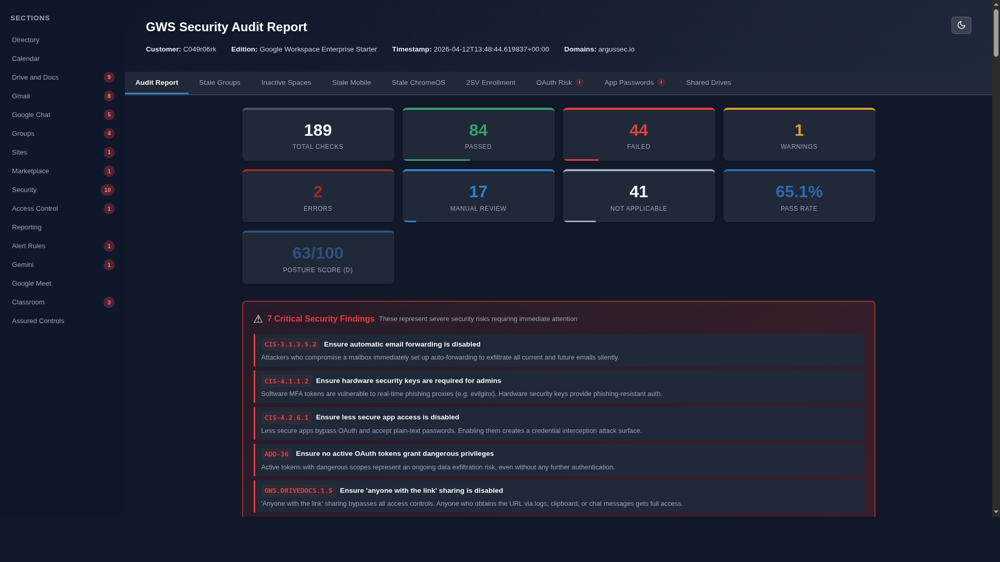

<p align="center">
  
</p>

<h1 align="center">GWS Security Auditor</h1>

<p align="center">
  <strong>Open-source Google Workspace security posture assessment tool</strong><br>
  Audit your GWS tenant against CIS Benchmarks, CISA SCuBA Baselines, and industry best practices.
</p>

<p align="center">
  <a href="#-installation"></a>
  <a href="#license"></a>
  <a href="#at-a-glance"></a>
  <a href="#at-a-glance"></a>
  <a href="#-interactive-dashboard"></a>
  <a href="#-standalone-executable"></a>
  <a href="#ai-security-analyst"></a>
</p>

---

## Description

GWS Security Auditor is a Python-based tool that automatically evaluates your Google Workspace configuration against four industry-standard security frameworks. It connects to your tenant via read-only API scopes, collects configuration data, evaluates **200 security checks** (including 24 critical-severity checks), and generates actionable reports in HTML, JSON, and CSV formats.

### Key Features

- **200 security checks** across 4 frameworks (CIS, CISA SCuBA, Google, Other)
- **Critical severity system** -- 24 checks flagged as critical with impact explanations
- **Interactive setup wizard** -- `gws-auditor setup` automates GCP project, API enablement, and service account creation
- **Multi-credential profiles** -- switch between tenants with `--profile`
- **Customer ID auto-discovery** -- no manual ID configuration needed
- **CI/CD integration** -- `--fail-on-critical` exits with code 2 for pipeline gates
- **Standalone executables** -- single-file binaries for Linux and Windows (no Python required)
- **Interactive dashboard** -- Plotly Dash web UI with dark mode, charts, and drill-down
- **AI security analyst** -- natural language queries via OpenAI, Anthropic, or AWS Bedrock

### CLI

```console
$ gws-auditor

  ╭──────────────── CRITICAL SECURITY FINDINGS (13) ────────────────╮
  │ CIS-4.1.1.1  2SV not enforced for admins                       │
  │ CIS-3.1.3.2.3  DMARC policy is weak (p=none)                   │
  │ ADD-33  7 apps with dangerous OAuth scopes                      │
  ╰─────────── These findings require immediate attention ──────────╯

      Audit Summary
  ┌─────────────────────┬───────┐
  │ Total Checks        │   200 │
  │ Passed              │    96 │
  │ Failed              │    64 │
  │   Critical Failures │    13 │
  │ Pass Rate           │ 60.0% │
  └─────────────────────┴───────┘
```

### HTML Report

<p align="center">
  
</p>

---

## At a Glance

| Framework | Full Name | Checks |
|-----------|-----------|-------:|
| **CIS** | CIS Google Workspace Foundations Benchmark v1.3.0 | 84 |
| **CISA** | CISA SCuBA Baselines for Google Workspace | 82 |
| **GOOGLE** | Google Security Checklist for Medium & Large Businesses | 21 |
| **OTHER** | Additional best-practice checks | 13 |
| | **Total** | **200** |

> [!TIP]
> Run `gws-auditor --list-checks` to see the full check list with IDs, titles, levels, sources, and severity.

---

## Installation

### pip (Recommended)

```console
# Core audit tool
pip install -e .

# With interactive dashboard
pip install -e ".[dashboard]"

# With AI analyst (choose one or all providers)
pip install -e ".[ai-anthropic]"
pip install -e ".[ai-openai]"
pip install -e ".[ai]"              # all providers

# With standalone build support
pip install -e ".[build]"

# Everything
pip install -e ".[dashboard,ai,dev,build]"
```

### Standalone Executable

Pre-built binaries are available on the [Releases](../../releases) page -- no Python installation required.

```console
# Linux
chmod +x gws-auditor-linux-amd64
./gws-auditor-linux-amd64 --credentials credentials.json --subject admin@company.com

# Windows
gws-auditor-windows-amd64.exe --credentials credentials.json --subject admin@company.com
```

> [!IMPORTANT]
> Standalone binaries don't bundle a `config.yaml`. You must pass at minimum
> `--credentials` and `--subject` on the command line.

To build from source:

```console
pip install -e ".[build]"
python build.py            # creates dist/gws-auditor
```

### Requirements

- Python 3.9+ (not needed for standalone executable)
- Google Workspace Super Admin or delegated admin access
- Service Account with domain-wide delegation (recommended) or OAuth 2.0 credentials

---

## Setup

### Automated Setup (Recommended)

The setup wizard automates GCP project configuration, API enablement, service account creation, and config generation:

```console
# Interactive wizard
gws-auditor setup

# With pre-set values
gws-auditor setup --project my-gcp-project --subject admin@company.com

# Use existing service account key
gws-auditor setup --existing-sa-key credentials.json --subject admin@company.com
```

The wizard handles 7 of 9 setup steps automatically. The **only manual step** is authorizing domain-wide delegation scopes in the Google Admin Console -- the wizard provides the Client ID, scope string, and a direct link.

### Manual Setup

See [docs/SETUP_GUIDE.md](docs/SETUP_GUIDE.md) for step-by-step manual instructions covering:

1. **GCP Project** -- create or select a project
2. **Enable APIs** -- Admin SDK, Gmail, Drive, Calendar, Groups Settings, Cloud Identity, Chrome Policy, Chat, Alert Center, License Manager
3. **Service Account** -- create with domain-wide delegation, download JSON key
4. **Domain-Wide Delegation** -- authorize 21 read-only scopes in Admin Console
5. **Configuration** -- create `config.yaml`
6. **Validation** -- `gws-auditor --validate` to test connectivity

### Configure

```yaml
auth:
  method: service_account
  credentials_file: credentials.json
  credentials_dir: credentials       # folder for multi-credential profiles
  subject: admin@company.com
  customer_id: auto                   # auto-discover from API (or explicit ID)
  profiles:                           # named credential profiles
    production:
      credentials_file: credentials/prod.json
      subject: admin@company.com
    staging:
      credentials_file: credentials/staging.json
      subject: admin@staging.company.com

checks:
  levels: [L1, L2]
  sources: [CIS, OTHER, GOOGLE, CISA]
  sections: all
  exclude: []

output:
  directory: ./reports
  formats: [html, json, csv]

options:
  cache_data: true
  cache_directory: ./cache
  org_units: all
  max_retries: 5
  rate_limit_qps: 10

ai:
  provider: anthropic               # openai, anthropic, or bedrock
  model: ""                          # blank = provider default
  api_key: ""                        # prefer env: ANTHROPIC_API_KEY / OPENAI_API_KEY
```

---

## Usage

### Full Audit

```console
gws-auditor                            # uses config.yaml
gws-auditor -v                         # verbose
gws-auditor -vv                        # debug logging

# Without config.yaml (minimum required arguments)
gws-auditor --credentials credentials.json --subject admin@company.com
```

> [!IMPORTANT]
> When no `config.yaml` is present, both `--credentials` and `--subject` are required.
> The `--subject` flag specifies the super-admin email used for domain-wide delegation.
> Without it, all API calls will fail with permission errors.

### Credential Profiles

```console
gws-auditor --profile ?                # list available profiles
gws-auditor --profile production       # use named profile
```

### CI/CD Pipeline

```console
gws-auditor --fail-on-critical         # exit code 2 if critical checks fail
```

### Filter and Target

```console
gws-auditor --check CIS-1.1.1         # single check
gws-auditor --level L1                 # baseline checks only
gws-auditor --source CIS --source CISA # multiple frameworks
gws-auditor --section Gmail            # specific section
gws-auditor --exclude CIS-1.1.3       # exclude checks
gws-auditor --cached ./cache/          # re-run on cached data
```

### Validate Connectivity

```console
gws-auditor --dry-run                  # quick auth test
gws-auditor --validate                 # detailed API probe
```

### CLI Reference

```
gws-auditor [OPTIONS] [COMMAND]

Commands:
  setup                   Interactive setup wizard
  dashboard               Launch web dashboard
  analyst                 AI security analyst REPL

Options:
  -c, --config PATH       Configuration file (default: config.yaml)
  --credentials PATH      Credentials JSON file
  --subject EMAIL         Delegated admin email
  --customer-id ID        Customer ID (default: auto)
  --profile NAME          Use named credential profile (? to list)
  --check ID              Run single check
  --level {L1,L2}         Filter by level (repeatable)
  --source {CIS,OTHER,GOOGLE,CISA}  Filter by source (repeatable)
  --section NAME          Filter by section (repeatable)
  --exclude ID            Exclude check IDs (repeatable)
  -o, --output-dir PATH   Output directory
  -f, --format {html,json,csv}  Output format (repeatable)
  --dry-run               Validate auth only
  --validate              Detailed API/scope validation
  --cached DIR            Re-run on cached data
  --list-checks           List all checks
  --fail-on-critical      Exit code 2 on critical failures (CI/CD)
  --resume                Resume interrupted collection
  --no-cloud-info         Suppress Argus Cloud info message
  --skip-update-check     Skip version update check
  --update                Update to latest version and exit
  -v, --verbose           Increase verbosity
  -q, --quiet             Suppress output
```

---

## Interactive Dashboard

```console
pip install -e ".[dashboard]"
gws-auditor dashboard                  # http://127.0.0.1:8050
gws-auditor dashboard --port 9000 --host 0.0.0.0
```

Features: report selector, multi-filter dropdowns, metric cards, status donut chart, section bar charts, detailed findings table with search, compliance drill-down, dark/light mode toggle, CSV/HTML export.

### AI Security Analyst

```console
pip install -e ".[ai-anthropic]"
export ANTHROPIC_API_KEY="sk-ant-..."
gws-auditor analyst --provider anthropic

# Or with OpenAI
pip install -e ".[ai-openai]"
export OPENAI_API_KEY="sk-..."
gws-auditor analyst --provider openai
```

Query audit findings in natural language, get remediation plans, compare reports, and analyze compliance posture. Also available as a chat page in the dashboard.

---

## Critical Checks

24 checks are tagged as **CRITICAL** -- failures represent severe security risks requiring immediate attention:

| Domain | Examples | Risk |
|--------|----------|------|
| **Authentication** | MFA not enforced, weak MFA methods, no session limits | Credential theft, account takeover |
| **Email** | Missing SPF/DKIM/DMARC, auto-forwarding enabled | Domain impersonation, data exfiltration |
| **Data Protection** | Public file publishing, 'anyone with link' sharing | Data breach, unauthorized access |
| **Infrastructure** | Dangerous OAuth apps, unrestricted third-party access | Silent data exfiltration, configuration tampering |

Each critical check includes a `critical_reason` explaining the business impact. The CLI shows a red banner for critical failures. Reports include severity and reason in JSON/CSV output.

---

## Posture Score

Every audit produces a **posture score** (0-100) that weights findings by severity. Critical failures are squared, so they dominate the score:

| Grade | Score | Meaning |
|:-----:|------:|---------|
| A | 90-100 | Excellent — minimal risk |
| B | 80-89 | Good — minor gaps |
| C | 70-79 | Fair — moderate risk |
| D | 50-69 | Poor — significant gaps |
| F | 0-49 | Critical — immediate action needed |

See the [Posture Score wiki page](../../wiki/Posture-Score) for the full formula, examples, and improvement guidance.

---

## Development

```console
git clone <repo-url>
cd gws-security-auditor
python -m venv .venv && source .venv/bin/activate
pip install -e ".[dashboard,ai,dev]"
pytest                                 # 1162 tests
```

### Building Standalone Executable

```console
pip install -e ".[build]"
python build.py                        # dist/gws-auditor (~90 MB)
python build.py --onedir               # faster startup
python build.py --clean                # clean rebuild
```

Push a tag `v*` to trigger the GitHub Actions workflow that builds Linux + Windows executables and attaches them to the release.

---

## Argus Cloud

> **Open source for individuals. Cloud-hosted for teams.**

GWS Security Auditor is and will always be free and open source. For teams that need automation, collaboration, and compliance history, [Argus Cloud](https://app.argussec.io/) extends the auditor with managed infrastructure:

| | Open Source (Free) | Argus Cloud (from €12.50/mo) |
|---|:---:|:---:|
| 200 security checks, 4 frameworks | ✓ | ✓ |
| HTML, JSON, CSV reports | ✓ | ✓ |
| Interactive dashboard | ✓ | ✓ |
| AI Analyst | BYO API key | Included |
| Automated daily/weekly scans | — | ✓ |
| Hosted dashboard with trends | — | ✓ |
| 12-month compliance history | — | ✓ |
| Regression alerts (Slack, email) | — | ✓ |
| Multi-tenant & team access | — | ✓ |
| JIRA, webhooks, RBAC | — | ✓ |
| Priority support | Community | Email |

[Sign up for free trial](https://app.argussec.io/) | [Pricing](https://argussec.io/pricing.html)

> [!TIP]
> To suppress the CLI cloud info banner, pass `--no-cloud-info` or set `GWS_AUDITOR_NO_CLOUD_INFO=1`.

---

## Acknowledgements

Inspired by [Prowler](https://github.com/prowler-cloud/prowler), [ScubaGoggles](https://github.com/cisagov/ScubaGoggles), and [GAM](https://github.com/GAM-team/GAM).

---

## License

This project is licensed under the **GNU Affero General Public License v3.0** (AGPL-3.0). See the [LICENSE](LICENSE) file for details.
